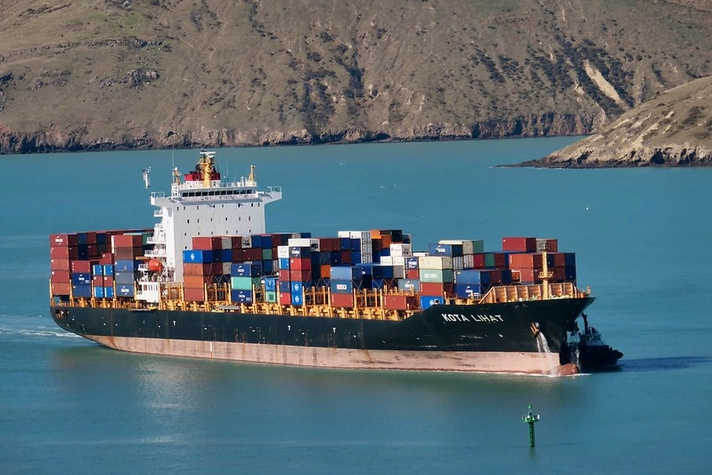

# Dockerfiles
Containers that are used for various reasons.

## :scroll: COPYRIGHT and License
The content of this documentation is of public domain.

"<a target="_blank" rel="noopener noreferrer" href="https://www.flickr.com/photos/88123769@N02/50399465168">KOTA LIHAT Container Ship.</a>" by <a target="_blank" rel="noopener noreferrer" href="https://www.flickr.com/photos/88123769@N02">Bernard Spragg</a> is marked with <a target="_blank" rel="noopener noreferrer" href="https://creativecommons.org/publicdomain/mark/1.0/?ref=openverse">Public Domain Mark 1.0 </img></a>. 

The license for the code can be found in the [LICENSE](./LICENSE) file.

---

Made in Québec :fleur_de_lis:, Canada 🇨🇦!
